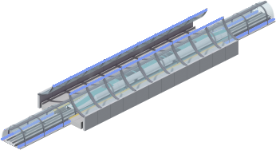
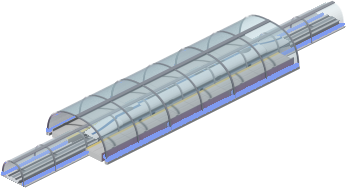

# Simutrans pak128 Maglev

A maglev add-on for Simutrans' pak128. Stock pak128 ships rail, road, tram and
monorail ways — the maglev waytype is left empty, with only a menu slot
reserved for it. This fills that slot with a complete system: guideways from a
160 km/h urban elevated to a 4000 km/h vacuum tube, sixteen trainsets from four
fictional manufacturers, five kinds of stop, plus bridges, tunnels, signals and
a depot. Every sprite is original artwork rendered from Blender and Python
source in this repository — no recoloured rail graphics.

- **85 objects, all generated.** 7 ways, 6 buildings, 3 bridge classes, 3 tunnel
  classes, 2 signals and 64 vehicle objects, packed into a 5.8 MB `.pak`. Every
  sheet is rebuilt from source by `make art`; no PNG here is hand-edited.
- **A speed ladder that forces choices.** Line speed is `min(vehicle, way)`, and
  the two ladders are deliberately staggered — the Meridian 500 of 2004 runs
  capped at 300 km/h until its guideway opens in 2014.
- **Trains stay visible through glass.** The tubes and the glazed stops ship
  RGBA sheets split into back and front halves, so a pod inside a tube or under
  a canopy is seen *through* it rather than hidden behind it.
- **Lit after dark.** Light coves, signal aspects and depot doorways are stamped
  to Simutrans' reserved light colours at pack time, so they keep glowing when
  the map dims. Every way also carries winter tiles.
- **Straight drags out of the box.** The add-on installs its own
  `simuconf.tab`, which retunes the way builder for the hundreds-of-tiles
  straight runs this roster is balanced around.
- **Economics generated, not guessed.** Payloads, costs and running costs come
  from `tools/gen_vehicle_roster.py`; the per-trainset revenue and stop-spacing
  figures are the engine's own formulas run over the shipped `.dat` values.


*Kestrel 620 — 620 km/h, three doors a side, on the pale composite 700 guideway.*




*The 2100 vacuum terminal and the 2064 concourse, each staged the way the game
layers it: way back, station back, stopped train, way front, station front.*

---

- [Getting started](#getting-started)
- [What's in the pak](#whats-in-the-pak)
- [The trains](#the-trains)
- [The companies](#the-companies)
- [How the artwork is made](#how-the-artwork-is-made)
- [Origins](#origins)
- [Status](#status)
- [Repository layout](#repository-layout)
- [Licensing](#licensing)

---

## Getting started

**You need:**

- Simutrans and the pak128 base package — this is an add-on, not a standalone
  pakset.
- `makeobj`, the pakset compiler, built from the Simutrans source tree.
- Python 3 with Pillow and numpy — `make build` runs `tools/check_assets.py`
  before every pack.
- Blender 5.x, but only if you want to regenerate artwork.

**Build the add-on:**

```sh
git clone https://github.com/akwiatkowski/simutrans-pak128-maglev
cd simutrans-pak128-maglev
make build       # -> dist/maglev-addon.pak  (5.8 MB, 85 objects)
```

The defaults assume the Simutrans repository is a sibling directory, built for
macOS (`$(GAME_REPO)/build/macos/src/makeobj/makeobj`):

```text
games/simutrans/
games/simutrans-pak128-maglev/
```

Point them elsewhere if it is not — on Linux or Windows you will need at least
`MAKEOBJ`:

```sh
make build \
  GAME_REPO=/path/to/simutrans \
  MAKEOBJ=/path/to/makeobj
```

**Install it into your own game.** Copy three things into your Simutrans user
directory — the folder that holds your `save/` and settings:

```sh
cd ~/path/to/your/simutrans/userdir
mkdir -p addons/pak128/text addons/pak128/config
cp /path/to/simutrans-pak128-maglev/dist/maglev-addon.pak addons/pak128/
cp /path/to/simutrans-pak128-maglev/src/maglev/text/*.tab addons/pak128/text/
cp /path/to/simutrans-pak128-maglev/src/maglev/config/simuconf.tab addons/pak128/config/
```

Then start the game with `-addons`. All three files matter:

- the `.pak` is the objects themselves;
- `text/*.tab` carries the display names — without it the depot list shows raw
  ids like `Maglev_Meridian500_Head`;
- `config/simuconf.tab` is the way-builder tuning. Simutrans parses it after
  the pakset's own config and before your personal `simuconf.tab`, so it never
  overrides your settings.

Start a game in 2000 or later, and the maglev toolbar is no longer empty.

**Or try it without touching your installation:**

```sh
make run
```

This builds, installs into the repository's ignored `evaluation/` sandbox, and
launches the game with a private user directory starting in 2000. Saves,
settings and add-ons stay inside the repository; the base pak128 package is
never modified. It expects a macOS build of the game — elsewhere, pass
`GAME_BINARY=/path/to/simutrans`.

---

## What's in the pak

**Guideways** — line speed is `min(vehicle, way)`, so a tier is a decision, not
an upgrade you take automatically:

| Tier | Speed | From | Character |
|---|---|---|---|
| Urban elevated | 160 km/h | 2008 | One level up on single columns, street free beneath — the monorail role |
| Open 300 "Pioneer" | 300 km/h | 2000 | Warm site-cast concrete, exposed stator packs, services on galvanised masts |
| Open 500 "Standard" | 500 km/h | 2014 | Seamless cool precast, safety-orange cable tray along each flank |
| Open 700 "Shell" | 700 km/h | 2032 | Pale composite with a flared skirt and lit glass wind fences |
| Tube 1000 | 1000 km/h | 2080 | Glazed vacuum tube, light cove along the springing |
| Tube 2000 | 2000 km/h | 2100 | Denser framing, deeper tint |
| Tube 4000 | 4000 km/h | 2165 | The end of the ladder |

Junctions and diagonals render as dark segmented steel on every tier — a real
maglev has no turnout to cast, only a bare girder that actuators flex sideways.
Tube junctions get a glass rotunda drum that glows as a landmark at night.

**Stops** ladder through the eras alongside the ways:

| Stop | From | Level | Capacity |
|---|---|---|---|
| Open stop | 2000 | 9 | 360 |
| Urban elevated stop | 2008 | 10 | 420 |
| Canopy shelter | 2032 | 12 | 520 |
| Concourse | 2064 | 15 | 700 |
| Vacuum terminal | 2100 | 22 | 1150 |

Waiting-room capacities are set explicitly because the engine default of
`level × 32` undersizes them badly against 200–380 seat trains.

**Crossings** come in three classes — 500 (2014), 1000 (2080) and 4000 (2165) —
deliberately *not* one per way tier. Since line speed is `min(way, bridge)`, a
700 trunk crosses valleys capped at 500 for half a century until the tube-era
crossing arrives. Both a block signal and a choose signal (which routes a pod to
any free platform) ship from 2000, and the depot completes the set.

The full design rationale is in [`docs/`](docs/): tier motifs, the ground under
the beam, junctions, crossings and the way-builder tuning in
[`docs/guideways.md`](docs/guideways.md); the front/back split, the reserved
lights and a rendered gallery of all five stops in
[`docs/stations.md`](docs/stations.md).

---

## The trains

Sixteen trainsets, entering service 2004–2175 and running to 2220. Each set is
four objects: a powered head, passenger and mail trailers, and a tail. Valid
formations are head + tail, or head + any mix of trailers + tail. Figures below
are per car, with the cost of the showcase formation used throughout the
detailed README (head + 4 cars + mail van + tail).

| Set | In service | Top speed | Seats/car | Mail/car | Head power | Formation |
|---|---|---|---|---|---|---|
| Meridian 500 | 2004–2094 | 500 km/h | 41 | 34 | 31 MW | 3.6M cr |
| Kestrel 260 | 2008–2053 | 260 km/h | 70 | 58 | 13 MW | 878,605 cr |
| Volta 220 | 2012–2052 | 220 km/h | 74 | 62 | 6 MW | 412,469 cr |
| Meridian 700 | 2018–2108 | 700 km/h | 40 | 33 | 60 MW | 5.0M cr |
| Kestrel 440 | 2020–2065 | 440 km/h | 66 | 55 | 37 MW | 1.4M cr |
| Volta 380 | 2026–2066 | 380 km/h | 70 | 59 | 18 MW | 692,820 cr |
| Meridian 1000 | 2036–2126 | 1000 km/h | 38 | 32 | 122 MW | 6.9M cr |
| Kestrel 620 | 2040–2085 | 620 km/h | 64 | 53 | 73 MW | 2.0M cr |
| Volta 540 | 2048–2088 | 540 km/h | 68 | 57 | 36 MW | 967,585 cr |
| Aetheris 2000 | 2064–2154 | 2000 km/h | 36 | 30 | 489 MW | 13.4M cr |
| Kestrel 880 | 2066–2111 | 880 km/h | 62 | 52 | 146 MW | 2.8M cr |
| Volta 760 | 2074–2114 | 760 km/h | 66 | 55 | 71 MW | 1.3M cr |
| Aetheris 4000 | 2105–2195 | 4000 km/h | 33 | 28 | 2.0 GW | 25.9M cr |
| Kestrel 1750 | 2110–2155 | 1750 km/h | 58 | 48 | 578 MW | 5.4M cr |
| Volta 1500 | 2120–2160 | 1500 km/h | 61 | 51 | 275 MW | 2.6M cr |
| Kestrel 3500 | 2175–2220 | 3500 km/h | 54 | 45 | 2.3 GW | 10.4M cr |

Every set has a rendered showcase and a paragraph of worked economics — margin
per tile, the stop spacing that maximises it, income per trip and per year, and
how long the formation takes to repay itself — in
[`docs/rolling-stock.md`](docs/rolling-stock.md#the-roster). Propulsion on a real
maglev lives in the guideway, not the vehicle, but Simutrans needs a vehicle to
own the power rating, so the head carries it.

Body shape follows the speed ladder: stock up to 500 km/h keeps narrowed
coupling ends so cars read as separate units; faster sets run their full
cross-section to the very end, and past 1000 km/h the cross-section rounds
toward a capsule — those trains live inside glass cylinders, and a cylinder is
what belongs inside a cylinder.


*Aetheris 4000 — 4000 km/h, all nose and no windows, seen through the tube glass.*

---

## The companies

The maglev century began quietly: a guideway hums instead of roaring, its
stators drink from the solar canopies strung along the corridor, and the land
underneath was never paved — orchards and meadow run right up to the piers.
Aviation faded not because anyone banned it, but because nobody missed it. Four
manufacturers share that century, and each sells a different answer to the same
question — what is speed worth?

**Meridian** builds flagships the way older centuries built bridges: to be
inherited. Founded around the first prototype guideway, it made its name with a
habit that looks like arrogance and works like patience — every Meridian set is
built for the *next* guideway, not the current one. The Meridian 500 of 2004
spent its first decade capped at 300 km/h, waiting for the track to catch up;
when the 500 guideway opened in 2014, every operator who had bought one got a
fleet upgrade for free. One door per car, a long nose, few seats, a service life
of ninety years — nothing Meridian makes is disposable, and its glazed skylight
cars were designed around a simple belief: at any speed, passengers deserve the
sky.

**Kestrel** builds the trains everyone actually rides. Three doors a side, short
dwell times, roughly 1.6× the seating of a comparable flagship, and a red stripe
that has meant "the commuter is coming" since 2008. Kestrel never chases records
— it ships an honest set for whatever the guideway can do today, engineered so a
depot with hand tools can keep it running for forty-five years. It outlasted
every rival at the game it plays: the Kestrel 3500 of 2175 is the last train
ever introduced on the roster, still a three-door commuter, now in a vacuum
tube.

**Volta** engineers the price down until everyone can board. An amber-striped
Volta arrives a few years after the equivalent Kestrel, a little slower and
noticeably cheaper — the maker of choice for town cooperatives and regional
lines that count credits per seat rather than seconds per trip. The frugality
shows in the details (two doors instead of three, a shorter service life) and in
the ledger, where a Volta 220 formation costs less than half its Kestrel
contemporary. Every network's unglamorous, load-bearing middle years run on
Volta.

**Aetheris** did not exist until the vacuum era made it inevitable. It appeared
in 2064 with a sealed 2000 km/h capsule — sixteen years before the first tube
opened — repeating Meridian's old bet at ten times the stakes. Its teal-striped
capsules are the only sets designed tube-first: smooth, nearly windowless hulls
that look wrong under open sky and perfect inside glass, gliding through sunlit
tubes whose light coves never dim. Continental distance for the energy budget of
a short-haul flight, and the quietest machines ever to cross a landscape without
touching it.

---

## How the artwork is made

Nothing in `src/maglev/images/` is hand-painted. Two renderers share one cell
layout, both driven from the Makefile:

```sh
make track-2d      # procedural 2D guideway sheet, seconds — for fast iteration
make track-3d      # Blender: all three open tiers, summer + winter
make tube          # the glazed vacuum tubes (RGBA sheets)
make fleet         # every trainset, eight travel directions per part
make art           # everything above, plus stops, depot, bridges, tunnels, signals
make check         # validate sheets before makeobj sees them
```

The pak128 grid, direction mapping, ramp projections and lighting were measured
off pak128's own rail sheet with `tools/sheet_inspect.py` rather than guessed —
8×11 cells of 128 px, the tile diamond centred on (63.5, 96), `#E7FFFF` as the
transparency key. `make iso-selftest` asserts the Blender camera still lands on
that pixel grid. See [`tools/README.md`](tools/README.md) for the measurements
and the camera rig.

The documentation galleries are generated too: `make docs` renders the station
scenes and trainset showcases and injects them between markers in
[`docs/stations.md`](docs/stations.md) and
[`docs/rolling-stock.md`](docs/rolling-stock.md).

---

## Origins

Years ago I built a maglev pak for pak128 by hand in Blender and lost the
sources. The guideway in this repository came out strikingly close to that old
one — same proportions, same read at map zoom — which is a good part of why it
exists. This time the whole thing is reproducible from source.

---

## Status

This is a prototype, and honest about it:

- **Not play-tested.** The sheets are verified by compositing them exactly the
  way Simutrans layers them, plus a clean `makeobj` pack. Nobody has run a long
  campaign against it yet.
- **Balance is calibrated, not proven.** Station levels are calibrated against
  pak128's own passenger stops (whose ceiling is Level 11 in 1989, while this
  ladder runs 9–22 into eras pak128 never reaches); vehicle costs are calibrated
  against pak128 stock and the engine's revenue model. None of it has met a
  human opponent's network.

Bug reports and balance feedback from an actual game are the most useful thing
anyone could send.

---

## Repository layout

| Path | What's in it |
|---|---|
| `docs/` | Design notes: [guideways](docs/guideways.md), [stops and depot](docs/stations.md), [rolling stock](docs/rolling-stock.md) |
| `src/maglev/` | Editable `.dat` files and sprite sheets — the pak's source |
| `src/maglev/vehicles/` | The 64 generated vehicle `.dat` files |
| `tools/` | The 2D renderer, Blender builders, sheet packer and asset checker, plus the [pipeline notes](tools/README.md) |
| `dist/` | Build output (`maglev-addon.pak`), git-ignored |
| `upstream/` | Sparse, blobless checkout of official pak128 source, kept as a local measurement reference only — not vendored, not redistributed |
| `evaluation/` | Local sandbox user directory for `make run`, git-ignored |

This repository is intentionally separate from the Simutrans engine and from the
downloaded pak128 package; neither is modified by anything here.

---

## Licensing

Artistic License 2.0, the same license as pak128's own graphical material.
Reference material derived from pak128 stays clearly separated and retains its
upstream attribution — read [`LICENSES/NOTICE.md`](LICENSES/NOTICE.md) before
copying or redistributing any reference asset.
