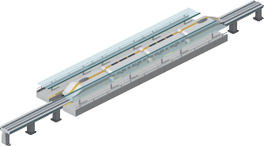
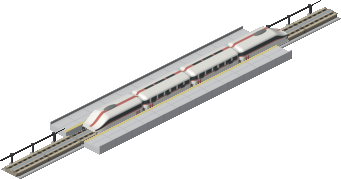
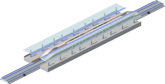

# Stops and the depot

The five stops, the depot, and how a station sprite is put together. Guideways
are in [guideways.md](guideways.md), rolling stock in
[rolling-stock.md](rolling-stock.md).

## How a stop is drawn

Stops, depot and concourse are Simutrans *buildings*: two orientations (layout 0
for a N/S way, layout 1 for E/W), each split into a back image drawn before
vehicles and a front image drawn after. That split is what puts the near
platform in front of a stopped train, and the shed in front of a stabled one.
The way keeps drawing the guideway underneath, so none of the sheets pave the
ground.

All are original artwork, rendered from the same Blender rig:

```sh
make station     # two platforms flanking the guideway
make skystop     # the urban elevated stop
make shelter     # canopy shelter
make concourse   # fusion-era glazed stop (RGBA sheet)
make depot       # ribbed superellipse maintenance hall
make art         # all of the above plus the ways and the fleet
```

## The ladder

Stops ladder through the eras like everything else:

| Stop | From | Level | Capacity |
|---|---|---|---|
| Open stop | 2000 | 9 | 360 |
| Urban elevated stop | 2008 | 10 | 420 |
| Canopy shelter | 2032 | 12 | 520 |
| Concourse | 2064 | 15 | 700 |
| Vacuum terminal | 2100 | 22 | 1150 |

Levels are calibrated against pak128's own passenger stops, whose ceiling is
Level 11 in 1989; this ladder runs into eras pak128 never reaches. Capacity is
set explicitly rather than left to the engine default of `level × 32`, which
undersizes waiting rooms badly against this roster's 200–380 seat trains — each
is sized to hold about 1.5 full era-matching trainloads.

The **canopy shelter** (2032) is the 700 era's stop: thin flat glass canopies on
slim steel posts, a lit rail along each platform edge in the same reserved light
as the guideway's fence bases, so shelter and track glow together after dark.

The **concourse** (`maglev_concourse.dat`, intro 2064, the year Aetheris
appeared) is the fusion-era roofed stop: the tube in bloom. A wide superellipse
glass vault spans both platforms on the tube's 8m hoop grid, so hoops land on
tile joints and chain down a long platform. It is split down the crown exactly
like the tube — far half in the back image, near half in the front image — so a
waiting train is seen *through* the canopy. A light cove runs along both
springing lines on a low concrete base beam, swapped to the reserved light at
pack time: a night concourse glows like the tubes it feeds. Its sheet is RGBA,
like the tubes', because glazing needs real per-pixel alpha.

The **vacuum terminal** (2100) is the vacuum century's interchange: twin
gull-wings in the 2000 tube's deeper glass, rising to lit lips that face each
other over the arriving pods.

## The depot

The depot is a superellipse vault — the tube's own engineered-fairing family,
not a barrel — in pale 700-tier composite, its character told the way every tier
tells its own: one bold rhythm (proud steel rib hoops continued down the walls
as pilasters) plus working detail sized for 128px. The crown spine carries the
overhead crane rail out over the doorway, skylight strips run between the ribs,
the flank glazing is segmented bay by bay, extraction pods and a comms mast sit
on the far slope, and the 500 guideway's safety-orange conduit arrives home
along the plinth. The door portal and the interior service-pit bars render in
the magenta marker and are stamped to the reserved `#7F9BF1` at pack time —
after dark the doorway stays outlined and the hall glows faintly through the
open door.

## Gallery

<!-- stations:begin -->

Generated by `tools/render_readme_stations.py` — each stop staged the way the game layers it, on its era's guideway with an era-matching trainset at the platform.

#### Urban elevated stop — 2008, Level 10



The 160 km/h urban tier's stop: railed floating platforms and thin teal-fascia canopies, lifted by the engine onto the elevated ground while the guideway's own columns carry the street beneath. A Volta 220 calls, capped at metro speed — any trainset can, since every pod wraps the same beam.

#### Open stop — 2000, Level 9



Two bare platforms flanking the guideway, amber safety strips and nothing overhead: the pioneer decade's stop, here with a Kestrel 260 commuter set on the 300 guideway between its service masts.

#### Canopy shelter — 2032, Level 12



The 700 era's stop: thin flat glass canopies on slim steel posts, a lit rail along each platform edge in the same reserved light as the guideway's fence bases — shelter and track glow together after dark. Shown with a Kestrel 620 on the 700 shell guideway.

#### Concourse — 2064, Level 15


The fusion era's roofed stop, the tube in bloom: one glazed superellipse vault spanning both platforms on the tube's own hoop grid, split down the crown so a waiting train is seen through the glass. A Meridian 1000 waits inside the 1000 tube.

#### Vacuum terminal — 2100, Level 22


The vacuum century's interchange: twin gull-wings in the 2000 tube's deeper glass rise from outer walls to high lit lips facing each other over the arriving pods. An Aetheris 2000 capsule slides in beneath them.

<!-- stations:end -->
