# Maglev Source Assets

Editable maglev `.dat` files and source images live in this directory, kept
apart: infrastructure `.dat` files sit at the root, the generated vehicle
`.dat` files in `vehicles/`, and every sprite sheet in `images/` — dat files
reference them as `images/...` (root) or `../images/...` (vehicles). The asset
Makefile writes generated `.pak` files to `dist/`.

All original maglev assets in this directory use Artistic License 2.0.

## Track

The track sheets are **generated**, not hand-edited. Each open tier has its
own sheet — `maglev_track_{300,500,700}.png` — rendered by Blender from
`TRACK_TIERS` in the builder; the 2D renderer keeps feeding the shared
`maglev_track.png`, which serves as the fallback base for failed cells and
quick iteration. All use the same 8x11 cell layout as pak128's rail sets:

```sh
make track-2d     # procedural 2D renderer, seconds
make track-3d     # Blender render + pack, all three tiers, ~6 minutes
```

See `tools/README.md` for how the pak128 grid, direction mapping, ramp
projections and lighting were measured off the reference rail sheet, and for
the Blender camera parameters. Edit `tools/render_maglev_track.py` or
`tools/blender/build_maglev_track.py` rather than the PNGs.

Tier character follows the tubes' law — escalation is density of engineering —
run so the open ladder converges toward the tube, and each tier tells it
through where its services live. Every motif is sized to survive 128px: hue
temperature on the girder (warm sand → cool precast → pale shell) plus one
bold rhythm per tier; centimetre realism that reads as flat grey at map zoom
is deliberately exaggerated.

- **300 "Pioneer"** — warm site-cast concrete, heavy segment joints, and
  exposed stator packs as raised dark blocks dashed along the guidance slots
  (real geometry, not a seam texture — the world-XY seam grid would smear a
  dash into a stripe on any run it parallels). Its services hang beside the
  beam on galvanised masts, two feeder cables sagging between them,
  world-anchored so the line of posts marches straight through tile joints.
- **500 "Standard"** — the seamless cool precast norm. The masts are gone:
  services moved into a safety-orange cable tray clamped along each flank,
  proud clamp blocks giving it a tick rhythm. The tray carries a whisper of
  self-emission so shade cannot turn the paint to mud.
- **700 "Shell"** — pale engineered composite with a flared skirt and low
  glass wind fences; the cables have vanished into the shell entirely. Each
  fence stands on a lit base rail rendered in the magenta marker and swapped
  at pack time for the reserved `#7F9BF1` light — the guideway already
  carrying a sliver of the tube's light cove, two threads that stay lit when
  the map dims.

Winter tells the same story: unheated beams vanish under the same snow as the
apron (the 300's slots fill with snow between the stator packs, its dark
masts standing against the white), the 500 keeps its orange thread through a
grey map, and the 700's powered deck melts itself into a wet black ribbon
with its edge threads still burning. Each tier keeps its own toolbar icon in
row 0 — the guideway slice under the speed sign wears the tier's colours —
and every sheet carries winter tiles as well as summer ones.

### The ground under the beam

The guideway does not pave its tile. Each run rides a precast foundation
band barely wider than the deck — a drainage gutter along each slab edge —
and everything beyond the band stays living terrain, the same read as
pak128's own ballast strips. The trackside hardware stands on that band or
on its own footings: the 300's masts get concrete pads out on the grass,
while the 500 and 700 grow service cabinets on a world-anchored rhythm
along the slab edge — their cables are buried, and boxes on the surface
are what buried services look like. The packer keeps everything outside
the rendered footprint transparent, so terrain, snow and slopes show
through exactly as the map draws them.

### Junctions and diagonals: the bending beam

A real maglev has no turnouts to cast — a switch is a bare steel box girder
that actuators flex sideways, and a "curve" is that same bending beam. Every
tile where runs meet or bend (switches, crossings, and the 45° diagonals)
therefore renders its girder as dark segmented steel, one tier-neutral
machine surface across the whole ladder; the tier's dressing — stator packs,
cable tray, wind fences, masts, the 700's skirt — steps back for the length
of the mechanism and resumes beyond it. The flexing surface is kept ice-free,
so junctions stay dark on a winter map and can be spotted at a glance.

### Signals

`maglev_signal.dat` ships a single-head block signal and a twin-head choose
signal (routes a pod to any free platform), both from year 2000. The sheet is
generated by `make signal`; lamp pixels are stamped to the reserved lights
`#FF211D`/`#01DD01` at pack time, so an aspect keeps glowing after dark, and
a repeater lamp on the head's back keeps the aspect readable in the two
rotations that face away from the camera.

### Building long guideways

A maglev trunk wants to be straight for hundreds of tiles (see the stop
spacings under Trainsets), and the stock route search happily trades a
straight line for a cheaper wiggle. The addon ships
`config/simuconf.tab`, which `make install` places in
`addons/pak128/config/` — the engine parses it after the pakset's own
config, and your personal `simuconf.tab` still wins afterwards:

- **Every drag builds straight.** `straight_way_without_control = 1` makes
  the way tool always take the direct route (what holding Ctrl does):
  horizontal, vertical, clean 45° diagonals, shallow angles as one diagonal
  leg plus one straight leg. If terrain blocks the direct path the drag
  fails rather than wiggling around — drop a waypoint and build two legs.
  Single-player only; network games ignore the flag.
- **The free router is retuned** for when the flag is off or scripts build:
  S-bends are taxed hard (`way_double_curve` 6 → 40, `way_90_curve`
  15 → 120) while single 45° corners stay affordable — a long diagonal is
  legitimate routing, a zigzag is not. `way_count_maximum` rises to 8000 so
  a single 1,000-tile drag fits the search budget.
- **Parallel tracks are an engine feature nobody documents**: start and end
  your drag on *empty* tiles within one tile of an existing maglev way, and
  the router switches to prefer-parallel mode — hugging the neighbour costs
  1 per tile, drifting away 3, and merging into the existing line 25, so
  the second track lays itself alongside without touching the first. The
  raised `way_avoid_crossings = 64` makes it route around other ways
  instead of through them.

## Speed ladder

Way tiers and vehicle speeds are deliberately **staggered** — line speed is
`min(vehicle, way)`, so if they matched there would be no decision to make.

| Tier | Speed | From | Sheet |
|---|---|---|---|
| open | 300 | 2000 | `maglev_track_300.png` |
| open | 500 | 2014 | `maglev_track_500.png` |
| open | 700 | 2032 | `maglev_track_700.png` |
| tube | 1000 | 2080 | `maglev_tube.png` |
| tube | 2000 | 2100 | `maglev_tube2000.png` |
| tube | 4000 | 2165 | `maglev_tube4000.png` |

See the plan for why the ladder is staggered against the vehicle roster.

## Enclosed guideway (tiers 4-6)

The glazed tubes are the only sheets written as **RGBA** — glass needs real
per-pixel alpha, which the `#E7FFFF` key cannot express. `make tube` renders
the 1000; the 2000 and 4000 use the same geometry with denser or sparser
framing and a deeper tint (`TUBE_TIERS` in the builder).

At a junction the branch bore is rendered at 90% scale so it nests inside the
through bore, rather than two equal tubes clipping edge to edge.

A light cove runs along the springing, rendered in a marker colour and swapped
during packing for `#7F9BF1` — a reserved Simutrans light that does not darken
at night, so a tube line stays lit when the map dims.

It carries **two full ribi sets** in four 5-row blocks (back summer, front
summer, back winter, front winter). The back images hold the apron, the beam
and the far half of the tube; the front images hold the near half, which
Simutrans draws *after* vehicles, so a pod is seen through the glass rather
than hidden behind it.

The tube keeps the same central beam as every other tier, which is what makes
all rolling stock compatible with all guideways: every pod wraps the same beam,
so it cannot look wrong on any tier.

## Stop, depot, concourse and vehicle

All are original artwork, rendered from the same Blender rig:

```sh
make station     # two platforms flanking the guideway
make depot       # ribbed superellipse maintenance hall
make concourse   # fusion-era glazed stop (RGBA sheet)
make fleet       # every trainset in the roster, eight travel directions each
make art         # all of the above plus the track
```

Stop, depot and concourse are Simutrans *buildings*: two orientations (layout
0 for a N/S way, layout 1 for E/W), each split into a back image drawn before
vehicles and a front image drawn after. That split is what puts the near
platform in front of a stopped train, and the shed in front of a stabled one.
The way keeps drawing the guideway underneath, so none of the sheets pave the
ground.

The **depot** is a superellipse vault — the tube's own engineered-fairing
family, not a barrel — in pale 700-tier composite, its character told the way
every tier tells its own: one bold rhythm (proud steel rib hoops continued
down the walls as pilasters) plus working detail sized for 128px. The crown
spine carries the overhead crane rail out over the doorway, skylight strips
run between the ribs, the flank glazing is segmented bay by bay, extraction
pods and a comms mast sit on the far slope, and the 500 guideway's
safety-orange conduit arrives home along the plinth. The door portal and the
interior service-pit bars render in the magenta marker and are stamped to the
reserved `#7F9BF1` at pack time — after dark the doorway stays outlined and
the hall glows faintly through the open door.

The **concourse** (`maglev_concourse.dat`, intro 2064, the year Aetheris
appeared) is the fusion-era roofed stop: the tube in bloom. A wide
superellipse glass vault spans both platforms on the tube's 8m hoop grid, so
hoops land on tile joints and chain down a long platform. It is split down
the crown exactly like the tube — far half in the back image, near half in
the front image — so a waiting train is seen *through* the canopy. A light
cove runs along both springing lines on a low concrete base beam, swapped to
the reserved light at pack time: a night concourse glows like the tubes it
feeds. Its sheet is RGBA, like the tubes', because glazing needs real
per-pixel alpha.

Vehicle sizing follows pak128's convention rather than real metres — measured
against its own Shinkansen, a pak128 car is about two thirds of its real height
and half its real length. Modelling to true Transrapid dimensions produced a
body that read as a fat white pill beside everything else.

## Rolling stock

Four vehicle types make up a train, generated per trainset into `vehicles/`
by `tools/gen_vehicle_roster.py` (`*_head`, `*_car`, `*_mail`, `*_tail`):
the powered head, unpowered passenger and mail trailers, and the tail.
Valid formations are head + tail, or head + any mix of trailers + tail.

All four roles share one body loft; the roof tells them apart, because the
30-degree camera shows far more roof than flank. Passenger cars carry glazed
skylight panes framed by the accent crown band; mail vans have a sealed crown
with grey roof hatches (and no windows at all); the head carries a dorsal
power blister on whatever flat roof its nose leaves — fast sets grow the nose
until the blister disappears, so a vacuum capsule stays smooth. Door pockets
are recessed and commuter window bands segmented, both behind the
`SCULPTED_FLANKS` flag in `tools/blender/build_maglev_vehicle.py` for easy
revert.

Every vehicle carries its manufacturer's glyph on both flanks near the
coupling end — Meridian's disc, Kestrel's twin bars, Volta's lightning step,
Aetheris' ring — billboard-sized (~1.3m) in the livery accent, because at
4px per metre a realistic emblem is two pixels of nothing.

Body shape follows the speed ladder. Stock up to 500 km/h keeps the classic
narrowed coupling ends that let cars read as separate units; everything
faster runs its full cross-section to the very end — a sealed, continuous
train, with the sprite gap as the only separation. Past 1000 km/h the
cross-section itself rounds toward a capsule (fully cylindrical by 2000):
those sets live inside the glazed tubes, and a cylinder is what belongs
inside a cylinder. The skirts and the guideway channel never change — every
body wraps the same beam on every tier.

The tail is the head's geometry with the windscreen blanked to body colour,
rendered as its own sheet and used with every direction swapped for its
opposite, so the nose faces back down the train: a train has a lit front and
a blind back.

The nose is a wedge rather than a cone. The body wraps its guideway all the way
to the tip, so the skirts cannot pull in — narrowing them would drive the
underside channel into the beam. The taper is therefore nearly all in height,
measured about the floor line, with only a slight draw-in of the upper body.

Propulsion on a real maglev is in the guideway, not the vehicle, but Simutrans
needs a vehicle to carry the power rating, so the head does.

## Trainsets

<!-- trains:begin -->

Generated by `tools/render_readme_trains.py` — the numbers are the Simutrans standard revenue and acceleration formulas run over the actual dat values (sources and assumptions in the script header). Distances are in tiles; income in credits.

#### Meridian 500

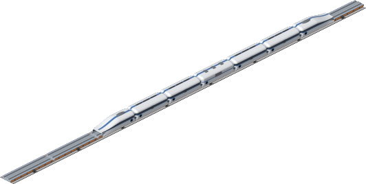

Meridian 500 is the speed leader of its generation: 500 km/h, sold 2004–2094, 208 passengers and 34 bags of mail in the showcase formation (head + 4 cars + mail van + tail, 3,596,838 cr). At launch the 300 guideway caps it at 300 km/h — while its own top speed drags the fleet average (and everyone's fares) around — so it does not earn properly until its 500 tier opens in 2014; the numbers below are from that era. Against the 326 km/h fleet average it earns 22.2 cr per tile fully loaded and burns 3.3 cr per tile to move, so the margin is 18.9 cr per tile. From a standing start it needs about 10 tiles to wind up, which sets the most efficient stop spacing at ≈**980 tiles**: closer stops trade cruise for wind-up, further ones add almost nothing. At that spacing a full train clears ≈**18,512 cr per trip** and, shuttling constantly (37 trips a game year), ≈**689,150 cr per year** — the formation pays for itself in about 5.2 years.

#### Kestrel 260

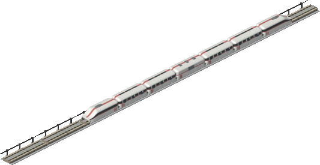

Kestrel 260 is the commuter workhorse of its generation: 260 km/h, sold 2008–2053, 354 passengers and 58 bags of mail in the showcase formation (head + 4 cars + mail van + tail, 878,605 cr). It runs full speed on the 300 guideway of 2000. Against the 380 km/h fleet average it earns 8.6 cr per tile fully loaded and burns 7.1 cr per tile to move, so the margin is 1.5 cr per tile. From a standing start it needs about 5 tiles to wind up, which sets the most efficient stop spacing at ≈**449 tiles**: closer stops trade cruise for wind-up, further ones add almost nothing. At that spacing a full train clears ≈**619 cr per trip** and, shuttling constantly (42 trips a game year), ≈**26,249 cr per year** — the formation pays for itself in about 33.5 years. It is built for commuter work: on 256-tile hops it still banks ≈25,291 cr per year — 92% of its ceiling, most of the rest lost to the mandatory four-tile crawl into every platform.

#### Volta 220

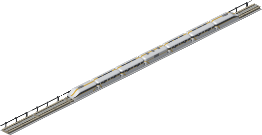

Volta 220 is the budget option of its generation: 220 km/h, sold 2012–2052, 376 passengers and 62 bags of mail in the showcase formation (head + 4 cars + mail van + tail, 412,469 cr). It runs full speed on the 300 guideway of 2000. Against the 326 km/h fleet average it earns 8.8 cr per tile fully loaded and burns 8.2 cr per tile to move, so the margin is 0.6 cr per tile. From a standing start it needs about 10 tiles to wind up, which sets the most efficient stop spacing at ≈**531 tiles**: closer stops trade cruise for wind-up, further ones add almost nothing. At that spacing a full train clears ≈**257 cr per trip** and, shuttling constantly (31 trips a game year), ≈**7,836 cr per year** — it never quite repays its 412,469 cr before it retires; buy it to put maglev where nothing better goes, not to get rich. It is built for commuter work: on 256-tile hops it still banks ≈7,430 cr per year — 90% of its ceiling, most of the rest lost to the mandatory four-tile crawl into every platform.

#### Meridian 700

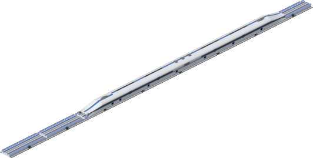

Meridian 700 is the speed leader of its generation: 700 km/h, sold 2018–2108, 202 passengers and 33 bags of mail in the showcase formation (head + 4 cars + mail van + tail, 4,952,131 cr). At launch the 500 guideway caps it at 500 km/h — while its own top speed drags the fleet average (and everyone's fares) around — so it does not earn properly until its 700 tier opens in 2032; the numbers below are from that era. Against the 416 km/h fleet average it earns 24.5 cr per tile fully loaded and burns 3.3 cr per tile to move, so the margin is 21.2 cr per tile. From a standing start it needs about 10 tiles to wind up, which sets the most efficient stop spacing at ≈**1348 tiles**: closer stops trade cruise for wind-up, further ones add almost nothing. At that spacing a full train clears ≈**28,570 cr per trip** and, shuttling constantly (38 trips a game year), ≈**1,082,497 cr per year** — the formation pays for itself in about 4.6 years.

#### Kestrel 440

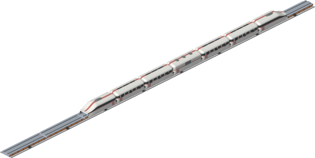

Kestrel 440 is the commuter workhorse of its generation: 440 km/h, sold 2020–2065, 334 passengers and 55 bags of mail in the showcase formation (head + 4 cars + mail van + tail, 1,448,263 cr). It runs full speed on the 500 guideway of 2014. Against the 424 km/h fleet average it earns 19.5 cr per tile fully loaded and burns 7.1 cr per tile to move, so the margin is 12.4 cr per tile. From a standing start it needs about 5 tiles to wind up, which sets the most efficient stop spacing at ≈**717 tiles**: closer stops trade cruise for wind-up, further ones add almost nothing. At that spacing a full train clears ≈**8,818 cr per trip** and, shuttling constantly (45 trips a game year), ≈**394,908 cr per year** — the formation pays for itself in about 3.7 years. It is built for commuter work: on 256-tile hops it still banks ≈362,302 cr per year — 87% of its ceiling, most of the rest lost to the mandatory four-tile crawl into every platform.

#### Volta 380

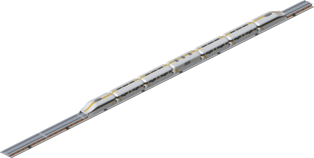

Volta 380 is the budget option of its generation: 380 km/h, sold 2026–2066, 356 passengers and 59 bags of mail in the showcase formation (head + 4 cars + mail van + tail, 692,820 cr). It runs full speed on the 500 guideway of 2014. Against the 416 km/h fleet average it earns 16.6 cr per tile fully loaded and burns 8.2 cr per tile to move, so the margin is 8.4 cr per tile. From a standing start it needs about 9 tiles to wind up, which sets the most efficient stop spacing at ≈**711 tiles**: closer stops trade cruise for wind-up, further ones add almost nothing. At that spacing a full train clears ≈**5,958 cr per trip** and, shuttling constantly (39 trips a game year), ≈**232,420 cr per year** — the formation pays for itself in about 3.0 years. It is built for commuter work: on 256-tile hops it still banks ≈213,448 cr per year — 87% of its ceiling, most of the rest lost to the mandatory four-tile crawl into every platform.

#### Meridian 1000

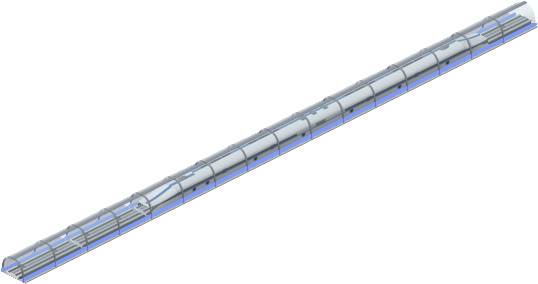

Meridian 1000 is the speed leader of its generation: 1000 km/h, sold 2036–2126, 192 passengers and 32 bags of mail in the showcase formation (head + 4 cars + mail van + tail, 6,948,948 cr). At launch the 700 guideway caps it at 700 km/h — while its own top speed drags the fleet average (and everyone's fares) around — so it does not earn properly until its 1000 tier opens in 2080; the numbers below are from that era. Against the 875 km/h fleet average it earns 13.3 cr per tile fully loaded and burns 3.3 cr per tile to move, so the margin is 10.0 cr per tile. From a standing start it needs about 10 tiles to wind up, which sets the most efficient stop spacing at ≈**1901 tiles**: closer stops trade cruise for wind-up, further ones add almost nothing. At that spacing a full train clears ≈**18,937 cr per trip** and, shuttling constantly (38 trips a game year), ≈**726,855 cr per year** — the formation pays for itself in about 9.6 years.

#### Kestrel 620

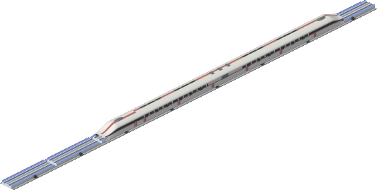

Kestrel 620 is the commuter workhorse of its generation: 620 km/h, sold 2040–2085, 324 passengers and 53 bags of mail in the showcase formation (head + 4 cars + mail van + tail, 2,005,773 cr). It runs full speed on the 700 guideway of 2032. Against the 515 km/h fleet average it earns 24.2 cr per tile fully loaded and burns 7.1 cr per tile to move, so the margin is 17.1 cr per tile. From a standing start it needs about 5 tiles to wind up, which sets the most efficient stop spacing at ≈**1010 tiles**: closer stops trade cruise for wind-up, further ones add almost nothing. At that spacing a full train clears ≈**17,229 cr per trip** and, shuttling constantly (45 trips a game year), ≈**771,756 cr per year** — the formation pays for itself in about 2.6 years. It is built for commuter work: on 256-tile hops it still banks ≈672,720 cr per year — 83% of its ceiling, most of the rest lost to the mandatory four-tile crawl into every platform.

#### Volta 540

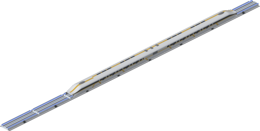

Volta 540 is the budget option of its generation: 540 km/h, sold 2048–2088, 344 passengers and 57 bags of mail in the showcase formation (head + 4 cars + mail van + tail, 967,585 cr). It runs full speed on the 700 guideway of 2032. Against the 517 km/h fleet average it earns 20.4 cr per tile fully loaded and burns 8.2 cr per tile to move, so the margin is 12.2 cr per tile. From a standing start it needs about 9 tiles to wind up, which sets the most efficient stop spacing at ≈**984 tiles**: closer stops trade cruise for wind-up, further ones add almost nothing. At that spacing a full train clears ≈**11,991 cr per trip** and, shuttling constantly (40 trips a game year), ≈**480,215 cr per year** — the formation pays for itself in about 2.0 years. It is built for commuter work: on 256-tile hops it still banks ≈420,407 cr per year — 83% of its ceiling, most of the rest lost to the mandatory four-tile crawl into every platform.

#### Aetheris 2000

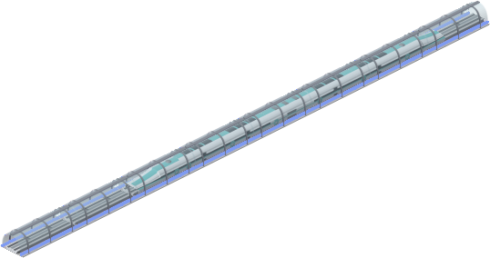

Aetheris 2000 is vacuum-era stock, built for the enclosed tubes: 2000 km/h, sold 2064–2154, 182 passengers and 30 bags of mail in the showcase formation (head + 4 cars + mail van + tail, 13,424,733 cr). At launch the 700 guideway caps it at 700 km/h — while its own top speed drags the fleet average (and everyone's fares) around — so it does not earn properly until its 2000 tier opens in 2100; the numbers below are from that era. Against the 1068 km/h fleet average it earns 25.5 cr per tile fully loaded and burns 3.3 cr per tile to move, so the margin is 22.2 cr per tile. From a standing start it needs about 10 tiles to wind up, which sets the most efficient stop spacing at ≈**3743 tiles**: closer stops trade cruise for wind-up, further ones add almost nothing. At that spacing a full train clears ≈**82,968 cr per trip** and, shuttling constantly (39 trips a game year), ≈**3,234,571 cr per year** — the formation pays for itself in about 4.2 years.

#### Kestrel 880


Kestrel 880 is the commuter workhorse of its generation: 880 km/h, sold 2066–2111, 314 passengers and 52 bags of mail in the showcase formation (head + 4 cars + mail van + tail, 2,797,637 cr). At launch the 700 guideway caps it at 700 km/h — while its own top speed drags the fleet average (and everyone's fares) around — so it does not earn properly until its 1000 tier opens in 2080; the numbers below are from that era. Against the 875 km/h fleet average it earns 17.4 cr per tile fully loaded and burns 7.1 cr per tile to move, so the margin is 10.3 cr per tile. From a standing start it needs about 5 tiles to wind up, which sets the most efficient stop spacing at ≈**1436 tiles**: closer stops trade cruise for wind-up, further ones add almost nothing. At that spacing a full train clears ≈**14,732 cr per trip** and, shuttling constantly (45 trips a game year), ≈**658,768 cr per year** — the formation pays for itself in about 4.2 years. Commuter spacing is beneath it by this era: 256-tile hops still pay ≈535,329 cr per year, but that is only 77% of its ceiling — at these speeds the four-tile platform crawl eats the hop, so keep it on trunks.

#### Volta 760

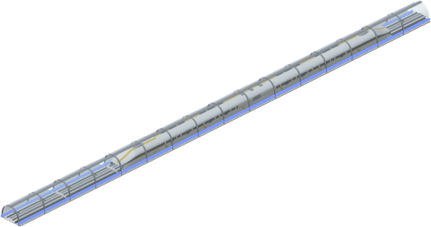

Volta 760 is the budget option of its generation: 760 km/h, sold 2074–2114, 334 passengers and 55 bags of mail in the showcase formation (head + 4 cars + mail van + tail, 1,338,512 cr). At launch the 700 guideway caps it at 700 km/h — while its own top speed drags the fleet average (and everyone's fares) around — so it does not earn properly until its 1000 tier opens in 2080; the numbers below are from that era. Against the 875 km/h fleet average it earns 14.0 cr per tile fully loaded and burns 8.2 cr per tile to move, so the margin is 5.8 cr per tile. From a standing start it needs about 9 tiles to wind up, which sets the most efficient stop spacing at ≈**1368 tiles**: closer stops trade cruise for wind-up, further ones add almost nothing. At that spacing a full train clears ≈**7,858 cr per trip** and, shuttling constantly (41 trips a game year), ≈**318,599 cr per year** — the formation pays for itself in about 4.2 years. Commuter spacing is beneath it by this era: 256-tile hops still pay ≈261,708 cr per year, but that is only 78% of its ceiling — at these speeds the four-tile platform crawl eats the hop, so keep it on trunks.

#### Aetheris 4000

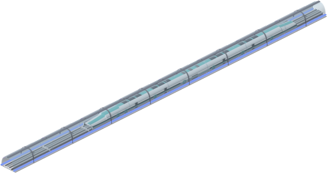

Aetheris 4000 is vacuum-era stock, built for the enclosed tubes: 4000 km/h, sold 2105–2195, 168 passengers and 28 bags of mail in the showcase formation (head + 4 cars + mail van + tail, 25,934,928 cr). At launch the 2000 guideway caps it at 2000 km/h — while its own top speed drags the fleet average (and everyone's fares) around — so it does not earn properly until its 4000 tier opens in 2165; the numbers below are from that era. Against the 4000 km/h fleet average it earns 9.3 cr per tile fully loaded and burns 3.3 cr per tile to move, so the margin is 6.0 cr per tile. From a standing start it needs about 11 tiles to wind up, Its most efficient stop spacing is off the chart — even **4,000 tiles** between stops leaves it short of full stride, so give it the longest trunk a map can hold. At that spacing a full train clears ≈**24,082 cr per trip** and, shuttling constantly (70 trips a game year), ≈**1,684,812 cr per year** — the formation pays for itself in about 15.4 years.

#### Kestrel 1750

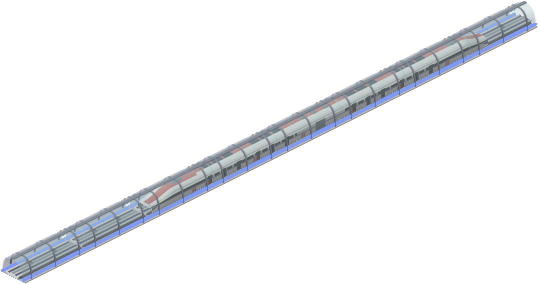

Kestrel 1750 is the commuter workhorse of its generation: 1750 km/h, sold 2110–2155, 294 passengers and 48 bags of mail in the showcase formation (head + 4 cars + mail van + tail, 5,374,974 cr). It runs full speed on the 2000 guideway of 2100. Against the 1731 km/h fleet average it earns 16.6 cr per tile fully loaded and burns 7.1 cr per tile to move, so the margin is 9.4 cr per tile. From a standing start it needs about 5 tiles to wind up, which sets the most efficient stop spacing at ≈**2858 tiles**: closer stops trade cruise for wind-up, further ones add almost nothing. At that spacing a full train clears ≈**26,898 cr per trip** and, shuttling constantly (45 trips a game year), ≈**1,201,743 cr per year** — the formation pays for itself in about 4.5 years. Commuter spacing is beneath it by this era: 256-tile hops still pay ≈796,606 cr per year, but that is only 63% of its ceiling — at these speeds the four-tile platform crawl eats the hop, so keep it on trunks.

#### Volta 1500

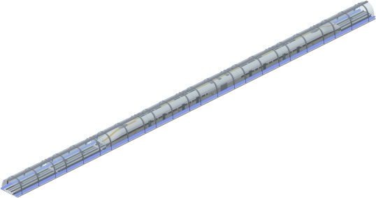

Volta 1500 is the budget option of its generation: 1500 km/h, sold 2120–2160, 310 passengers and 51 bags of mail in the showcase formation (head + 4 cars + mail van + tail, 2,553,862 cr). It runs full speed on the 2000 guideway of 2100. Against the 2050 km/h fleet average it earns 9.1 cr per tile fully loaded and burns 8.2 cr per tile to move, so the margin is 0.9 cr per tile. From a standing start it needs about 9 tiles to wind up, which sets the most efficient stop spacing at ≈**2689 tiles**: closer stops trade cruise for wind-up, further ones add almost nothing. At that spacing a full train clears ≈**2,253 cr per trip** and, shuttling constantly (41 trips a game year), ≈**91,797 cr per year** — the formation pays for itself in about 27.8 years. Commuter spacing is beneath it by this era: 256-tile hops still pay ≈62,032 cr per year, but that is only 64% of its ceiling — at these speeds the four-tile platform crawl eats the hop, so keep it on trunks.

#### Kestrel 3500

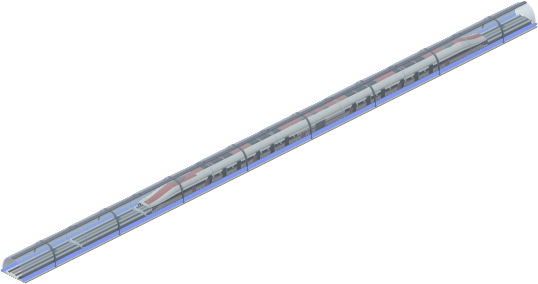

Kestrel 3500 is the commuter workhorse of its generation: 3500 km/h, sold 2175–2220, 274 passengers and 45 bags of mail in the showcase formation (head + 4 cars + mail van + tail, 10,384,297 cr). It runs full speed on the 4000 guideway of 2165. Against the 3750 km/h fleet average it earns 13.3 cr per tile fully loaded and burns 7.1 cr per tile to move, so the margin is 6.2 cr per tile. From a standing start it needs about 5 tiles to wind up, Its most efficient stop spacing is off the chart — even **4,000 tiles** between stops leaves it short of full stride, so give it the longest trunk a map can hold. At that spacing a full train clears ≈**24,706 cr per trip** and, shuttling constantly (63 trips a game year), ≈**1,544,198 cr per year** — the formation pays for itself in about 6.7 years. Commuter spacing is beneath it by this era: 256-tile hops still pay ≈762,786 cr per year, but that is only 46% of its ceiling — at these speeds the four-tile platform crawl eats the hop, so keep it on trunks.

<!-- trains:end -->

## Display names

`text/en.tab` carries the display names; `make install` copies it to
`addons/pak128/text/`, which is where Simutrans looks for addon translations
(`dataobj/translator.cc`). Without it the depot list shows raw object ids.
Regenerate it alongside the roster.

## Known gaps

- `Level=9` on the stop is rough. Vehicle costs and running costs are now
  calibrated against pak128's own rail stock and the standard engine's
  revenue model (see `tools/render_readme_trains.py`), but none of it has
  been play-tested against a human opponent's rail network.
- Nothing has been run in the game yet. Everything is verified by compositing
  the sheets the way Simutrans layers them, plus a clean `makeobj` pack.
- Junction tiles simply let the two tubes intersect. It reads acceptably as a
  cross vault, but a proper junction treatment would be better.

## Historical artwork

`versions/` keeps earlier passes for reference. They are not compiled:

- `v0-rail-placeholder/` — the original reused pak128 rail images
- `v1-blue-guideway/` — first tint pass

Gameplay track versions are the compiled `.dat` speed tiers, not these
directories.
